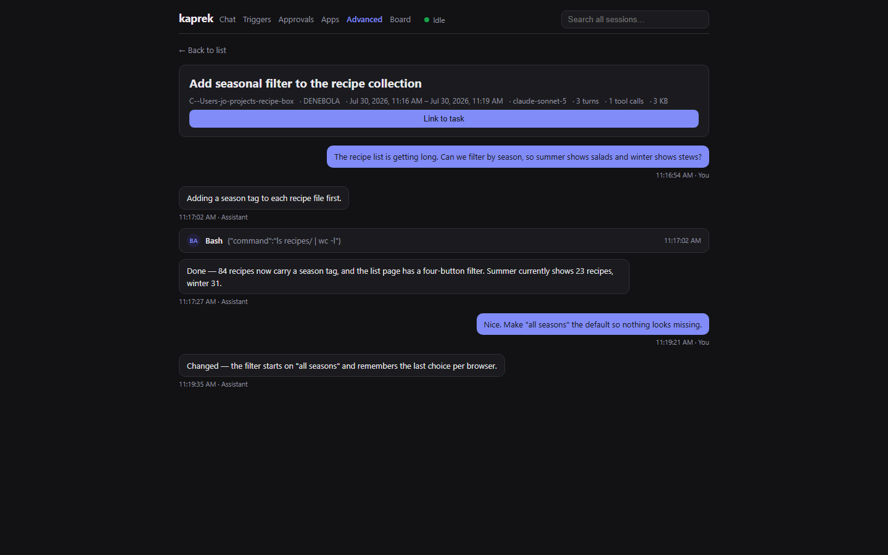

# kaprek

Your Claude Code sessions never die — you just can't see them.

kaprek is a local supervision layer around the Claude Code
and Codex CLIs you already have. It keeps every session as a
searchable thread, runs scheduled triggers through that CLI,
and files approval questions to an inbox that survives a restart.

No API key. No account. No server of its own.

Status: early preview. Windows has the most real use.
macOS/Linux should work; issues welcome. Node 22+.



*The screenshot shows synthetic demo data, not a real session.*

## Quickstart

```
npx kaprek
# → opens http://127.0.0.1:4900 — all projects, all sessions, thread view
```

No install and no config for kaprek itself, and it has no account of its own. Ctrl+C stops the server.

Viewing transcripts needs nothing else. Chat and triggers need the `claude` CLI installed and signed in — kaprek runs your CLI and never asks for an API key.

## How you work with it: zero steps

With the hooks installed (`kaprek hooks install`, once), the daily loop needs no kaprek command at all. You work in your terminal as before; kaprek runs underneath:

- Your first Claude Code session of the day **starts the server itself** — no command, no browser tab ([Starting and stopping](#starting-and-stopping)).
- Every session start **injects what kaprek knows** about that directory — mission, project memory — and **syncs your memory files** into the store ([SessionStart](#sessionstart-what-kaprek-knows-about-this-directory)).
- If the session then wanders to a different directory — you open Claude Code in `~` and only `cd` into a project afterward — **the context follows it**: the next prompt you send re-checks the working directory and, if it changed, injects what kaprek knows about the new one ([UserPromptSubmit](#userpromptsubmit-context-that-follows-the-directory)).
- Every session end **updates the ledger** and **harvests remember blocks** ([Stop](#stop-what-the-hook-writes), [SessionEnd](#sessionend-closing-the-ledger-entry)).
- A big change that ends without a peer review **gets one automatic council nudge** ([Council as a gate](#council-as-a-gate)).

The only two commands worth remembering are for the exceptional moments: `kaprek resume` after a terminal crash, and `kaprek council "<question>" --diff` for a second opinion on demand. The browser at `http://127.0.0.1:4900` is for looking things up, not for operating anything.

## Updating

```
kaprek update          # look, and install if there is something newer
kaprek update --check  # only look
```

This is the one command that talks to the internet, and it says so before it
does. There is no check on start: a tool that phones home every time it boots
is a tool nobody can reason about.

What it does depends on how kaprek got onto the machine, because only one of
those can be updated by npm:

| Installed as | `kaprek update` |
| --- | --- |
| global (`npm i -g kaprek`) | installs the new version |
| through `npx` | tells you to run `npx kaprek@latest` — nothing is installed to update, and without `@latest` npx reuses its cache |
| a project's dependency | tells you to update it in that project |
| a git checkout | tells you to `git pull` — npm would overwrite your working tree; with uncommitted changes it says so first, because `git pull` is not allowed to overwrite them |

After a successful install, `kaprek update` asks the running instance which
version it actually carries (the same local question the single-instance lock
answers on start). If an older kaprek is still running, it says so and notes
that the running server picks up the new version at the next `kaprek stop`.

When anything goes wrong — npm missing, no permission to write the global
install, the registry not answering — the message ends with the line that
works from all of those anyway:

```
npx kaprek@latest
```

kaprek reads data directories written by older versions without complaint —
a missing field means the old behavior, never a crash. The fixtures pinning
those older formats live in `src/testdata/legacy-datadir/`, and every change
to a file format extends them.

## Flags

| Flag | Default | Description |
| --- | --- | --- |
| `--port <n>` | `4900` | Port to listen on. If taken, tries up to 10 higher. |
| `--dir <path>` | `~/.claude/projects` | Root directory to scan for sessions. |
| `--no-redact` | off | Disable secret redaction in session digests. |
| `--no-open` | off | Don't open the default browser automatically. |
| `-h, --help` | — | Show usage and exit. |

## Features

- Lists every project and session found under `~/.claude/projects`, sorted by recency.
- Thread view per session: user/assistant turns, tool calls, subagent transcripts.
- Streaming parser handles multi-hundred-MB JSONL files without loading them whole into memory.
- Secret redaction on by default, applied before any truncation.
- Zero runtime dependencies. The web UI ships as a prebuilt static bundle.
- Preserves a session's scratchpad work products (scripts, data, images) before OS temp cleanup deletes them — see [Artifact preservation](#artifact-preservation).
- Missions: name a goal once, point it at a real project directory, and every chat, task, and pending question of that work hangs together — see [Missions](#missions).
- Two engines: chats run on your Claude Code CLI by default, or on your Codex CLI — picked per chat, same approval flow, same inbox — see [Engines](#engines).
- Guided planning: say what you want to build and answer a few cards instead of a wall of questions; the plan lands at a path kaprek chose and shows up under [Plans](#plans) — with its full path, so you never go hunting through folders for it.
- Council: put your engines in four roles (lead, thinker, worker, peer) and ask the ones you are not using for a second opinion — kaprek shows where they disagree rather than smoothing it over. See [Council](#council).
- Recipes: a relay run's shape is a file, not code — who takes part, which handoff asks you first, which step may touch files. See [Relays and recipes](#relays-and-recipes).
- Memory with scopes: what one agent learned is there for the next one, and a scope that is not on your path upwards is invisible — see [Memory](#memory).
- Setup page (`#/setup`): which agent CLIs are installed and signed in on this machine, where their config lives, which MCP servers they have, and which keys your `.env` defines — paths and names only, never a value.

## Missions

A mission (`#/missions`) is what you're trying to get done: a title, a goal,
and optionally the project directory the work lives in. Chats started inside a
mission are linked to it, board tasks can be linked to it, and the mission's
detail page shows what is waiting on you — the same durable inbox questions,
grouped by the work they belong to. There is only one interface: the same
missions page serves a weekend project and a client codebase alike.

**The working-directory rule, stated plainly:** by default every chat turn
runs in a jailed `<dataDir>/workspace` directory, so an agent never edits
whatever directory kaprek happened to be started from. A mission may point at
a real project directory instead. That is the one deliberate door out of the
jail, and it is bound to an explicit human act: you type the absolute path
once when creating the mission, it is checked to exist right there, and it is
re-checked on every turn — if the directory is gone the turn fails with an
error rather than silently falling back to the workspace. Every turn of that
mission (including follow-ups addressed by chat id alone) runs in the
mission's directory, with the same permission flow as any other turn.

Presets pre-fill a new mission: two generic ones ship built in (`blank` and
`guided-feature`), and you can add your own as JSON files under
`<dataDir>/presets/` — `{id, title, description, goalTemplate, firstPrompt}`.
A user preset with a builtin's id replaces it; an invalid file is skipped with
a warning, never a crash.

**Morning digest.** A mission's detail page has a digest card, and
`GET /api/missions/<id>/digest?since=&until=` builds the same thing: a
Markdown report of one window — the trigger runs of the night (ran / skipped
because the skip-if condition was false / skipped because the condition could
not be judged, with the short cause / failed, each with duration), the open
deferred questions with the time they have left against their 24-hour
deadline, costs and tokens, and the files the run records themselves name.
The digest is **numbers only, deliberately** — no model call, no engine, no
network anywhere behind the route — because kaprek's promise is "no network
except the update check", and a morning report that spends a turn to say what
the log already says would break both that promise and the rule that a digest
must never cost more than what it reports. A missing value stays `unknown`:
it is never written as 0 and never silently swallowed by a sum — the header
counts coverage ("Kosten bekannt für 3 von 5 Läufen"), and sums are labelled
as the known part. A mission with no runs in the window still gets its
digest, with the 0-line, not an absence. The window is the interval between
two local midnights as real time points, so a DST day is honestly 23 or 25
hours and the header states the actual span; the default window (no
`since`/`until`, epoch-ms or ISO) is yesterday's local day. Each build is
stored as `<dataDir>/missions/<id>/digests/<datum>.md` (the local date of the
window's end — for the morning default, today) and building again on the same
day **overwrites that one file**: the digest is a report, not a store; history
lives in `runs.jsonl`. `GET /api/missions/<id>/digests` lists the files on
disk. Delivery is kaprek's usual single command (`notify.json`), and the
digest's header names the window when you pipe it there. You wire that up
yourself with a schedule trigger whose command fetches the digest route and
feeds it to your notifier — for example, a trigger whose prompt is one line
that runs:

```
curl -s -H "x-kaprek-token: <token>" -H "x-app-request: 1" \
  "http://127.0.0.1:<port>/api/missions/<id>/digest" | ntfy publish my-morning-topic
```

No digest trigger is created for you — kaprek does not send anything you did
not ask it to send.


## Advanced

The systems in this section are the advanced layer. They are in the app and they are not going away —
they are just not the headline: guided plans, the council, second engines, relays and recipes,
hierarchical memory, phone access on the LAN, the task board, and signed receipts.

### Plans

Say something like "let's build a small line counter" and kaprek offers to
work through it as a quiz: a few questions, each with two to four options and
a description of what choosing it means, plus a box for the answer nobody
listed. Answering sends the next turn with each question quoted next to your
answer.

When there is enough to design with, the agent writes the plan — to a path
kaprek decided BEFORE the turn started, not one it reports afterwards. That
inversion is the point. `#/plans` lists every plan, shows its absolute path
with a copy button, ticks steps straight into the file (so your editor and
your git see the same truth), and starts a chat that works through it.

A guided turn where the agent answered in prose anyway says so. The mode is
an instruction to a model, not a guarantee, and a quiet failure would leave
you with the old wall of text wearing a new label.

### Done is a claim — the convergence check

"Check the work against this plan" on `#/plans` starts a third guided mode,
`converge`: the agent reads the plan, looks only at the files and places the
plan itself names, and reports every gap as a fenced ` ```kaprek-findings `
block — `missing`, `partial`, `contradicts`, or `unrequested` (work nobody
asked for is reported, never removed), each with a severity, the evidence,
and the remaining work. kaprek appends the findings to the plan file as new
unchecked steps under a `## Convergence round N` heading, so they are
ticked off like any other step. Zero findings marks the plan done; that is
the only way past the gate without a name on it. Marking a plan done without
a clean check needs the name of the person who decided, and that override
is recorded on the plan and in every task receipt whose session the plan's
chat belongs to — a receipt with `converge` in its payload seals the plan's
state at signing time, so a later check or override invalidates it, like an
edited doc does. The gap taxonomy is spec-kit's (`/speckit-converge`); the
prompt, the fence, and the gate are kaprek's own.

**Edited outside kaprek.** Every plan carries a fingerprint of the file as kaprek last saw it — at registration, at a tick, at a converge round. A read that finds the file different says so: a badge in the list, a line in the detail with the time of that last sighting. Nothing is blocked by it; it is the one thing a reader needs to know before trusting the checkboxes, and the next tick or check brings kaprek's view up to date.

### Council

Four jobs, and whichever engines you have doing them:

| Role | Does |
| --- | --- |
| `lead` | Splits the work and puts the answers back together. |
| `thinker` | Architecture, algorithms, the analysis worth paying for. |
| `worker` | Boilerplate, tests, mechanical edits. |
| `peer` | Independent second opinion. Several are fine. |

No model name is wired into kaprek. Running Codex as the lead with Claude on
the peer bench is two dropdowns on `#/council`, and the suggestion you start
from is built from what is actually installed on your machine.

A consultation sends every peer the same package — the question, the files
worth reading, the constraints, what was already ruled out — in parallel and
read-only. A peer never sees your conversation: an investigation's thread
does not survive being handed over, and a peer answering from half the
context answers confidently and wrongly.

Peers answer with a verdict (`agree` / `concerns` / `disagree`), so one
dissenter means no consensus and you see the disagreement in the peer's own
words. If only one engine is installed, kaprek says there is no second
opinion to get instead of asking one model to review itself.

`off` / `plans` / `decisions` / `always` govern what kaprek asks **unasked**.
The "Second opinion" button in a chat works at every level, including `off`.
At `always` an ordinary turn gets one too, which is the expensive,
indiscriminate end of the setting and behaves like it says.

A peer that fails to answer twice in a row is skipped for a quarter of an
hour instead of being waited on for ten minutes again — and it is reported as
skipped, with the reason, because a quietly dropped peer would turn "two
engines agreed" into a sentence about one. That memory is per session: a cold
start tries everything once, since the CLI that was broken yesterday is
usually the one that was updated overnight.

One honest gap: `decisions` currently behaves exactly like `plans`. The
moment exists and is respected, but nothing in kaprek can truthfully report
"that was an architecture decision" yet, and guessing it from the text would
give you a setting that fires on the word "decided".

At `plans` and above, writing a plan is the moment that fires by itself: the
peers get the plan's path and read the file. That consultation does **not**
hold the turn open — it takes minutes, it runs beside the chat, and its
result lands in `#/chat` when it is done, whether or not the tab stayed open.
One consultation per chat at a time, two in total. A verdict about a plan you
edited afterwards is marked as stale rather than shown as review, and one
interrupted by a restart says so instead of being quietly asked again.

### From the terminal (`kaprek council`)

`kaprek council "<question>" [--file <path>]... [--cwd <dir>] [--constraint <text>]... [--diff [<ref>]] [--json]` asks the configured peers blind and in parallel, from any terminal — no browser turn needed. Files go out as the same redacted snapshots the web council uses; a secrets file is refused. The verdicts are printed and saved under `<dataDir>/council/cli/<timestamp>.json`. Exit 0 with answers, 1 when a peer or snapshot failed, 2 on bad arguments.

`--diff [<ref>]` adds the working tree's changes against `<ref>` (default `HEAD`) as one more snapshot — `git diff --stat`, `git diff`, and the untracked files, combined into a virtual `git-diff.patch` and put through the same redaction as `--file`, at hunk granularity: a secrets file's own hunk is removed and named as `[redacted: <path>]` rather than the whole diff being refused. Capped at 200,000 characters; past that the snapshot is cut with a note. `--diff` and `--file` combine freely. Outside a git repo, or with nothing to diff, it prints why and exits 1.

### Engines

A new chat picks which already-installed, already-authenticated CLI runs its
turns: `claude` (the default) or `codex`. The choice is fixed at chat
creation — one conversation is one CLI session, and handing a resume id from
one CLI to another is not a thing — and shows as a badge afterwards; the
default engine deliberately shows nothing.

The Codex engine speaks JSON-RPC to `codex app-server`, spawned per turn the
same way `claude -p` is. Approvals work identically from your side: with the
default permission mode, Codex runs in a read-only sandbox, so every write it
wants becomes a question — in the live approval dialog or the durable inbox,
wherever the turn is running. Honest differences, declared by the registry
(`GET /api/engines`) rather than discovered mid-turn: Codex reports token
usage but **no dollar figure** (cost shows as unknown, never as a made-up
number), an approval cannot rewrite the proposed input on allow, and
Claude-specific options (allowed tools, MCP config, settings files) do not
apply.

A chat's own engine is still fixed at creation. A **relay recipe** is the one
place where several engines work inside one chat on purpose — see below.

### Relays and recipes

A relay is a controlled handoff between agents: each step is an event in the
chat log, under a budget, with a human gate. A **recipe** says who takes part
and in what order — it is data, and `<dataDir>/recipes/*.json` is yours to
add to. `GET /api/recipes` lists what is available; the relay panel picks one.

```json
{
  "id": "write-review-apply",
  "title": "Draft, review, then apply",
  "steps": [
    { "id": "write",  "agent": "grok" },
    { "id": "review", "agent": "claude" },
    { "id": "apply",  "agent": "codex", "tools": "full" }
  ],
  "edges": [
    { "from": "write",  "to": "review" },
    { "from": "review", "to": "apply", "requiresHuman": true },
    { "from": "apply",  "to": "write" }
  ],
  "budgets": { "maxRounds": 2, "hardMaxTurns": 12, "retriesPerDispatch": 1 },
  "escalation": { "onPeerFailure": "stop", "onBudget": "question" }
}
```

- **Edges carry the policy.** `requiresHuman` asks *before* the step on the
  far side runs, which is the only moment the answer can still change
  anything. The approval buys exactly one passage of that edge and no extra
  round; the same edge asks again next time round.
- **Tools are per step and fail-closed.** A step gets none unless it says
  `"tools": "full"`, and only `claude` and `codex` steps can — a text peer has
  no tools to give. A step that has them runs in the mission's own directory,
  and every action it takes goes through the approval inbox with the same
  24-hour window a trigger's question gets. That is what lets an overnight
  batch park on a question instead of being auto-denied.
- **Retries are budgeted**, with 15s then 30s of backoff, each attempt in the
  log under its own dispatch id. When they are spent, `escalation` decides:
  `stop`, `question` (ask you), or `notify` (carry on past the broken step and
  say so).
- **The deferred inbox is the only human gate.** Round gates, edge gates and
  peer-failure questions all land there — as does every approval a step with
  tools asks for. A relay step *waits* on its question rather than ending and
  being replayed later, so the answer reaches the process (and the engine)
  that asked it. The honest limit: that question lives as long as the relay
  turn does, not for 24 hours.

Refusals happen before a run starts, not three handoffs in: an unknown agent,
an unknown recipe id, a duplicate step id, or a step no edge leads to.

Starting a relay from a trigger stays deliberately closed — an unattended
loop that starts itself is the one thing on the kill list.

### Memory

What was learned while working, kept per scope, so the next agent starts
with it instead of rediscovering it.

A scope is `person:` → `project:` → `mission:`, and **visibility runs
upwards, never down**. A mission sees its project sees its person; a person
does not see into their missions, and two trees that do not share a parent
see nothing of each other. That single rule is both halves of what memory
has to do: what Codex learned about a project is there for Claude, and a
scope belonging to somebody else's work is not readable from yours. Both are
tests, not assurances.

A turn inside a mission is given what its scope knows — profile first, then
facts, evidence only on request — and can add to it by answering with a
fenced block:

````
```kaprek-remember
{"text": "the deploy token lives in the CI settings, not in .env", "kind": "fact"}
```
````

The agent supplies the text; kaprek attaches the owner. An agent that could
name its own scope could write into one it may not read. A chat outside any
mission has no scope and neither reads nor writes.

The profile is frozen for the length of a conversation: a profile line
written while a chat is running takes effect in the next one. It sits at the
head of every prompt in that chat, which is exactly what a provider's prefix
cache keys on — changing it mid-conversation would throw away every cached
token for the rest of it. Facts are not frozen; they arrive as they are
learned.

Every statement carries an origin and an age. Past 90 days without a verify
it still comes back, marked stale — an agent that forgets on a schedule is
one nobody can reason about. Forgetting is an event with a reason, and
evidence is a pointer into a session, never a copied excerpt. `#/memory`
shows one scope at a time; there is deliberately no "everything" view.

Every memory also carries its **origin**: a turn names the chat it was
learned in, a sync names the memory file, an import names its source file —
and `#/memory` renders each as a link back to that source. Import entries
start *unconfirmed* (`lastVerifiedAt` stays empty until a person presses
"Still true"): an import that wrote its assumptions down as checked facts
would poison the memory faster than anyone could correct it. Entries written
before origins were recorded are marked "ohne Herkunft" — shown, never
hidden.

When the same failure pattern shows up three times, kaprek writes down the
rule it would add and asks. Until someone accepts it, that proposal reaches
no prompt at all — a system that turns its own observations into active rules
re-educates itself out of sight. Accepted rules go into the prompt as
instructions; a rejected one is not proposed again.

Not built, deliberately: vector search, embeddings, automatic summarizing of
raw transcripts, syncing between machines.


**Confirmed, not duplicated.** An agent that learns something another agent already wrote down in the same scope confirms it: the entry's count goes up, its sources grow, and its stale clock resets — a fact that three sessions learned carries that on its face (`confirmed 3× by 2 sources`), and the 90-day clock stops nagging about what work keeps re-learning. Same text, same scope, same kind; a withdrawn fact is a new entry again.
### Answering from a phone (`--lan`)

kaprek listens on `127.0.0.1`. `kaprek --lan` also listens on this machine's
network address and prints a QR code:

```
http://127.0.0.1:4900

Also reachable at http://192.168.1.42:4900 — anyone on this network who has
the token can answer your questions.
The token is in the QR code below. Scan it with your phone:

  █▀▀▀▀▀█ ▀▄█▀▄ █▀▀▀▀▀█
  ...
```

Scan it and the phone lands on the approvals inbox, where allow and deny are
full-width buttons a thumb can hit. An overnight batch parks on its question
and the answer reaches the turn that is waiting for it.

What holds either way:

- **The QR carries a second, narrower token.** It may read the inbox and
  answer one question. That is the whole list — it cannot start a chat, read
  a transcript, or change a setting, and `PUT /api/notify` is refused
  outright, which matters because that route's job is to run a command. The
  token is generated per run and never written to disk, so it dies when
  kaprek stops.
- **In LAN mode the served page never carries the instance token** — not
  even to loopback. A reverse proxy or an `ssh -L` tunnel on this machine
  connects as `127.0.0.1` while forwarding for someone else, so trusting the
  socket would hand it the admin token. The browser on this computer gets the
  token from the URL fragment when kaprek opens it (a fragment never reaches
  the server or a proxy log); if you run with `--no-open`, the terminal
  prints that URL. Without `--lan`, kaprek binds to loopback only and the
  page is bootstrapped the usual way.
- **The Host check gains exactly one address**, this machine's own. A
  hostname pointed at that IP is still refused, so DNS rebinding gets no
  further than it did before.
- **`--lan` is a flag, not a setting.** Opening a port to a network should
  not be something you can switch on once and forget.
- On a machine with no network address, `--lan` stays on loopback and says
  so rather than printing a QR for an address that does not exist.
### Task board

A local task board (`#/board`) for tracking work against these sessions.

The core rule: a task can only be marked done once it carries a complete 7-field completion record — what triggered it, the outcome, the approach taken, the course including any detours or failures, how it was verified, the effort spent, and what's still open. All seven fields are required and enforced server-side, not just suggested by the UI. It's the discipline your future self wants but never keeps on its own.

### Receipts

A receipt is an ed25519-signed snapshot of a completed task: its doc plus its linked sessions, signed at the moment you ask for one. It proves that a given key signed this exact state at this time — it does not prove the work is good, and the agent name is self-declared, not a verified identity. The verify view shows valid/invalid; editing the doc after signing invalidates the receipt, because verification always re-checks against the task's current state, not a stored snapshot.

## Make something (`#/home`)

Four things you might want, three questions each, and a result you can point
at:

- **Build a small game** — one file you double-click, and it plays
- **Plan a city trip** — a plan per day you can print or put on your phone
- **Build a small tool** — something that does one job and runs again tomorrow
- **Make a reel with a teleprompter** — a script you read off the screen while filming

There is no second product behind this. Each one becomes an ordinary mission
with an ordinary preset, run by the same engines through the same approval
inbox. What differs is what gets asked and what gets shown: no engine picker,
no permission mode, no token count, nothing on screen that only means
something to someone who already knows how this works.

At most three questions, because a fourth is a sign the first three were
vague. Then it works, and tells you where the result is and what it
remembered for next time.

## Sharing a way of working

A workflow is one file that carries how a recurring job is done: the preset
that starts it, the relay recipe that runs it, the council level it wants,
and the handful of facts a newcomer to that work needs. `POST /api/workflows`
writes one; `POST /api/workflows/preview` shows what taking someone else's
would change *before* anything is written, since a workflow sets the council
level and adds a recipe.

Absolute paths and anything naming a secret are refused at export rather than
stripped out. A file with a hole where a path used to be still looks
complete, and the person receiving it finds out at run time — the person
exporting is the one who can fix it.

## Running it unattended

**Start with the machine** — off unless you ask, and it is one file:

```
kaprek autostart install    # writes it
kaprek autostart status     # shows the path AND the contents
kaprek autostart uninstall  # deletes exactly that file
```

Startup folder on Windows, a LaunchAgent on macOS, a `.desktop` file on
Linux. No registry keys, no scheduled tasks, no service — "what did that tool
install on my machine" has to have a short answer, and `status` prints the
file so you can delete it by hand if you would rather not trust the
uninstall.

**Being told a question is waiting.** A deferred question is by definition
one nobody is watching, so kaprek runs one command you choose:

```
PUT /api/notify  {"command": ["ntfy", "publish", "my-topic"]}
```

The question goes in on stdin; `KAPREK_CHAT_ID`, `KAPREK_TOOL`,
`KAPREK_SOURCE` and `KAPREK_URL` go in as environment variables. What happens
next is not kaprek's business — a phone push, a desktop toast, a line in a
log, whatever you already use.

Never through a shell, and the question's text is never part of a command
line: an agent chooses what a tool is called, and that text must not become
something a shell interprets.

Where that guarantee ends is worth knowing: kaprek passes those values as
literals, but your notifier is your script. `echo $KAPREK_TOOL` unquoted in a
shell script re-opens exactly the door kaprek just closed — quote your
variables. A notifier that fails, hangs, or does not exist
changes nothing about the question — it stays in the inbox either way.

kaprek ships no channels of its own on purpose. A built-in list of them is
never finished, and every entry is a dependency or a vendor.

### Skip-if conditions (schedule and heartbeat triggers)

A schedule that fires every morning into an empty inbox is nine blind turns
out of ten. A heartbeat or schedule trigger may therefore carry one
`condition`, checked after its window is claimed and before the turn starts:

- `file-exists` — the path must be there, or the run is skipped.
- `file-newer-than-last-run` — the path's modification time must be newer
  than the trigger's own last run in `runs.jsonl`. No separate state file:
  the run log is the source of truth.

A skipped run never becomes a turn — no cost, no request to Anthropic — but
it is written to `runs.jsonl` (`skipped: "condition"`) and shown as
"übersprungen (Bedingung)" in the trigger's run history. The window stays
spent, so the condition is not re-checked in the same slot.

Failure is a different thing than "false". A path the condition cannot even
judge — outside the workspace (including via a symlink out of it), or a stat
that fails for a reason other than "not there" — skips the run too, but
loudly: `skipped: "condition-error"` in the log, a notification naming the
cause ("Bedingung fehlgeschlagen: … — Lauf übersprungen"), and a counter on
the trigger. Five in a row mark the trigger as **degraded** in the trigger
list. By default a trigger stays skipped while its condition is broken;
`onConditionError: "run"` makes it run anyway, with the error recorded on
that run and the counter still counting. The form runs the condition once
before you can save and shows you the verdict, including the resolved
absolute path that gets stored.

Deliberately missing: a `command` condition. Probing it at save time would
make the save button an exec surface, killing a misbehaving child cleanly
needs real process-group semantics, and the environment it would inherit is
unchecked authority. It comes back as its own package if a case appears that
the two file conditions do not cover.

## Search

Full-text search across every indexed session, backed by SQLite FTS5. Requires Node 22+, since it uses the built-in `node:sqlite` module — on older Node it degrades cleanly, the UI reports search as unavailable instead of crashing. Only redacted content is indexed, same as the digest view. Build or refresh the index from the reindex button in the search view (`#/search`), or `POST /api/search/reindex`.

**Every hit says whether it still points at anything.** At index time kaprek keeps the absolute paths a session's text named (drive-letter and POSIX paths, and `dir/file.ext` mentions resolved against the session's working directory — up to 200 per session, from the same redacted text the index holds). At search time each hit checks them against the disk: `present` (still there, not touched since the session's own last write), `changed since` (modified after the session), `gone`. The line under the snippet reads like "5 files named · 3 still there · 1 changed since · 1 gone — src/old/parser.mjs (gone)"; a session that named no file gets no line, because no verdict is not a clean one. The check is `fs.stat` and a date, bounded at 50 paths per hit; nothing is inferred from content and nothing searches for where a file might have moved. The idea comes from heimdall (ArihantDeva/heimdall, MIT): rank first, verify each hit against the disk second. An index built before this feature is dropped whole on first open (schema version bump) and offers its reindex button — a session with no recorded paths would otherwise read as "mentions nothing".

The index only covers a session's title plus its user/assistant text, truncated to the first 4,000 characters per event — tool output, thinking blocks, and subagent transcripts are not indexed at all. A search miss doesn't mean the term isn't in the session; it may just be outside what's indexed.


**Subscription windows.** Both CLIs say during a turn where their window stands (Claude Code's `rate_limit_event`, codex's `account/rateLimits/updated`); kaprek has logged that signal per turn since M1 and now shows the latest per engine on `#/setup` — how full, when it resets, which window, and as of when it was seen. Read back from `runs.jsonl`, never asked of a vendor: a window kaprek has not seen since the last turn is shown with that time, which is the honest form of "as of". `GET /api/usage` returns the same, raw signal included.
## Artifact preservation

Claude Code writes scratchpad work products (scripts, data files, images) under `<OS temp dir>/claude/<projectSlug>/<sessionId>/scratchpad/`, alongside the transcript it also writes to `~/.claude/projects`. The transcript survives — that's kaprek's whole reason to exist — but the OS temp directory does not; it gets wiped routinely, and a scratchpad disappears with it while the transcript that references it lives on.

kaprek sweeps every session's scratchpad into `<dataDir>/artifacts/<projectSlug>/<sessionId>/` in two ways: automatically (best-effort, small byte budget) when the Stop hook fires for that session, and fully (no budget beyond the caps below) whenever the search index is rebuilt (`POST /api/search/reindex`, including the button in `#/search`). A per-session `manifest.json` makes repeat sweeps idempotent — unchanged files are neither re-hashed nor re-copied. Two caps bound disk usage: a single file over 25 MB is skipped (recorded in the manifest as `too-large`), and once a session's preserved total crosses 100 MB (20 MB for the hook's own smaller sweep) further files are skipped as `session-budget`. A session's preserved artifacts, if any, show up under an "Artifacts" section on its thread view.

## Starting and stopping

kaprek starts itself: once its SessionStart hook is installed (see [Claude Code hook](#claude-code-hook-optional)), opening your first Claude Code session of the day brings it up in the background, with no browser tab and no command to remember (`KAPREK_NO_AUTOSTART=1` turns this off). Running `kaprek` yourself afterwards opens the browser on the instance that is already up instead of erroring. `kaprek stop` ends it.

## Resume after a crash (`kaprek resume`)

Windows Terminal dies, twenty sessions with it. kaprek reads the session stores of all four engines — `~/.claude/projects`, `~/.codex/sessions`, `~/.grok/sessions`, `~/.kimi-code/sessions` — and reopens them as terminal tabs, one `wt` tab per session, with the engine's own resume command (`claude --resume <id>`, `codex resume <id>`, and so on).

`~/.claude/projects` holds more than terminal sessions — every headless/cron run through kaprek's own engines lands there too, and looks like a session someone could resume even though nobody ever will. By default, `kaprek resume` only lists claude sessions that showed up in the terminal-session ledger (`<dataDir>/ledger/sessions.jsonl`, written by the SessionStart/SessionEnd hooks — see [SessionEnd](#sessionend-closing-the-ledger-entry) below); a headless run that never touched those hooks stays hidden. `--unfiltered` (`?unfiltered=1` on the route) turns that off and shows everything, exactly as before this filter existed. Other engines (codex, grok, kimi) have no ledger concept and are never filtered.

- `kaprek resume` lists the sessions of the last 7 days (`--days N`), all engines, newest first. Each claude session the ledger knows about shows "open" or "ended (\<reason\>)"; sessions that ended within the same short window are marked as a crash group (computed only over the sessions actually shown — a filtered-out headless run cannot make a real terminal session look like part of a crash). Titles are shown through the same redaction as everywhere else.
- `kaprek resume --all` reopens every **open** session from the last 24 hours (`--hours N`), one tab after another with a short pause so Windows Terminal keeps up. A claude session the ledger already marked ended is never opened this way, even inside the window. Exit 0 when every tab opened, 1 when any failed.
- `kaprek resume <engine>:<id>` (a unique prefix is enough) reopens one session. Unknown or ambiguous → exit 2 with the candidates.
- `--no-skip` starts Claude without `--dangerously-skip-permissions`.
- `--unfiltered` also lists/resumes claude sessions the ledger has never heard of.

The same list and buttons sit at the top of `#/list` (`GET /api/resume/sessions`, `POST /api/resume`, `POST /api/resume/batch`) — each row shows the same open/ended badge, and "Alle der letzten 24 h fortsetzen" only ever reopens open ones. Resuming a specific session by `engine:id` (the two `POST` routes) always works regardless of the ledger filter — it is the *list* that is filtered, not the ability to jump straight to a session you already know the id of. Scan results are cached under `<dataDir>/resume-cache/`; a session is never opened by a test.

## Claude Code hook (optional)

kaprek can install a Claude Code **Stop** hook that gently enforces the policy engine's rules (e.g. flagging a session that made a commit without a linked board task). It is opt-in only — nothing is installed by default.

Important: a Stop hook fires *after* the turn already ended — after any tool call in it, including a `git commit`, already ran. It cannot prevent a commit or require a task link "before" one happens; it can only look back at the transcript once the turn is over and react (log, warn, or refuse to end that particular Stop event) to what already occurred. Think of it as a nag, not a gate.

- `kaprek hooks install` adds four entries to `~/.claude/settings.json` — the Stop hook, the SessionStart hook below, the SessionEnd hook, and the UserPromptSubmit hook (backs up the file first, leaves any other hooks untouched).
- `kaprek hooks uninstall` removes only those entries, at any time, identified by a stable `--managed-by` marker so a later reinstall never creates a duplicate.
- `kaprek hooks status` shows whether each of the four is installed (one line per hook) and which policy mode is active.

### SessionStart: what kaprek knows about this directory

The same install adds a **SessionStart** hook. When a Claude Code session opens in a directory that is a kaprek mission's working directory, the session starts with what kaprek knows about that work, as context it can see: the mission's title and goal, how many questions are waiting in the kaprek inbox for it (with the address to answer them), the rules a person accepted from failure-to-policy proposals, and what earlier sessions wrote down for that project — the same rules and memory kaprek's own turns get, so a terminal session is no longer the one place they do not reach. Outside a mission directory the hook adds only the accepted rules, if any; with nothing to say it says nothing. The whole block is capped at 1,500 characters, the hook reads kaprek's data and never writes it, fails open on every error, and exits on its own after three seconds — it must never slow a session down. Same shape as the Stop hook: one script, no daemon, uninstalled with the same command.

### SessionEnd: closing the ledger entry

The same install adds a **SessionEnd** hook. It does exactly one thing: appends an `end` event (with Claude Code's session-end reason) to the session ledger described below, so `kaprek resume` can tell an open session from one that already ended. It reads nothing, writes nothing back to Claude Code (there is no output shape for this event), never blocks, and exits within one second on its own — this hook shares Claude Code's 1.5 s SessionEnd budget with whatever else has hooked into it.

### UserPromptSubmit: context that follows the directory

The same install adds a **UserPromptSubmit** hook. SessionStart only looks once, at the moment a session opens — a session that starts in one directory and later moves into another (Klaus often opens Claude Code in his home directory and `cd`s into a project from there) never gets the context for the directory it actually ends up working in. This hook re-checks the working directory on every prompt and, when it changed since the last one, sends the same `buildSessionStartContext` block SessionStart would have sent had the session opened there.

The common case — no directory change since the last prompt — is checked against a small per-session state file under `<dataDir>/context/` and costs nothing more than that one read: none of kaprek's mission/memory/chat stores are even loaded unless the directory actually changed. An unknown directory or an unchanged one produces no output either way. Exit code 2 on this event would both block *and delete* the person's prompt, so unlike every other kaprek hook a bug here is not just unhelpful but destructive — it fails open on every error, never blocks, and exits within one second on its own. State files untouched for over a week are swept the next time a directory change writes a new one.

### Memory follows your memory files

On startup, resume and clear, the SessionStart hook also reads your own Claude Code memory files (`~/.claude/projects/<slug>/memory/*.md`, override with `KAPREK_MEMORY_DIR`) and remembers each file's `description` as a fact in its project scope, so a fresh kaprek starts already knowing what you have written down elsewhere. It only reads files that changed since the last sync, skips anything that looks like a bare secret, and gives up after 700 ms — a directory of hundreds of files catches up over a few session starts, not all at once.

### Stop: what the hook writes

Since the terminal is where the work happens, the Stop hook also makes the terminal count:

- **Session ledger.** Every Stop, SessionStart and SessionEnd appends one line to `<dataDir>/ledger/sessions.jsonl`: type (`start`/`stop`/`end`), session id, working directory, transcript path, timestamp, and — for `end` only — the session-end reason Claude Code reports (`clear`, `resume`, `logout`, `prompt_input_exit`, `other`). Nothing from the transcript itself. This is what tells `kaprek resume` a session apart from a headless/cron run that never touched a hook — see [Resume after a crash](#resume-after-a-crash-kaprek-resume) — and whether it ended (`lastType: "end"`) or is still open.
- **Remember blocks.** When the assistant's turn contains a fenced ```kaprek-remember block (same protocol as kaprek's own turns), its lines become memory facts in the scope `project:<basename(cwd)>` (created under `person:local` if missing), origin `terminal:<sessionId>`. Nothing else is harvested — no auto-summaries, no transcript excerpts. The hook reads the transcript in bounded chunks from the tail, remembers where it stopped (`<dataDir>/memory/harvest/`), and never re-writes a fact it already wrote.
- Budget: 1.5 s for the harvest, exit 0 always; anything unfinished waits for the next Stop.

Policy mode lives in `<dataDir>/policy.json`: `observe` (default) fully evaluates both rules and logs any violation to `policy.log`, but always resolves to allow — it's for seeing what would happen before switching modes. `warn` writes its reasons to stderr (Claude Code hooks reference exit 0 as no objection either way, so this is best-effort visibility, not a blocking signal). `block` is the only mode that can actually end a turn abnormally, and even then at most once per session. The hook fails open on any internal error — a bug here must never stop you from ending a turn. This is the single exception to kaprek's read-only promise; every other feature only reads `~/.claude/projects`.

### Council as a gate

The Stop hook also runs a second, independent check: has this session's uncommitted change grown large enough that ending the turn without a second opinion would be reckless? It fires — once per session — when the working directory is a git repo, `git diff --stat HEAD` covers at least 5 files (untracked files count as files) or at least 150 changed lines, and no `kaprek council` result from this session already exists. The turn is blocked with a message telling Claude exactly what to run: `kaprek council "Review this change: defects, missed requirements, risky assumptions" --diff`, then act on the verdicts or say why not, then finish.

Unlike the policy engine's block above (JSON on stdout, exit 0), this uses the other block form Claude Code's Stop hooks support: exit code 2 with the reason on stderr. Every condition fails open — no git, git timing out, or anything else going wrong just means the gate does not fire, never that the turn hangs or errors out. Set `KAPREK_COUNCIL_GATE=0` to turn it off.

## Posture and hard denials

Two guards make "fail-closed" a setting rather than a sentence, both in `<dataDir>/policy.json`.

**Posture** is one dial, `"posture": "ask" | "edits" | "auto"`, in the same words as the chat picker's approval stance. It is a ceiling: a turn may pick any stance up to it, never past it. The default is `auto` (no ceiling — what every install before this field had). A mission can set its own posture on its page, and a mission's dial only ever tightens the global one in effect: `edits` under a global `ask` is still `ask`. A turn asked for past the ceiling is refused with a 400 naming the ceiling and where it comes from, not quietly clamped — a picker that says "auto" while the turn runs "edits" would be lying.

**Hard denials** hold in every posture, `auto` included. Built in and not switchable from an agent turn: writing an agent's own configuration (`~/.claude/**`, `~/.claude.json`, `~/.codex/**`, `~/.gemini/**`, `~/.kimi-code/**`, any `.mcp.json` — a turn that rewrites those rewrites the next session's rules), and a recursive delete aimed at a filesystem root, a home directory, or `*`. Add your own under `"hardDenials": [{"id": "…", "why": "…", "tools": ["Bash"], "command": "<regex>"}]` or with `"paths": ["**/secrets/**"]` (gitignore-style, `~/` and `//absolute` as in the CLI's own rules). Two layers enforce them: kaprek's own approval handler refuses the call whenever the CLI asks — chat, trigger, relay step, deferred inbox alike — and records the refusal as an approval event in the chat; and the settings file kaprek hands the CLI carries the path rules as `permissions.deny` (`Edit(~/.claude/**)` …), which the CLI evaluates itself and which is the only layer that still holds in `auto`, where the CLI never asks anyone. Command rules have no honest CLI form — the permissions reference itself notes that argument order defeats `Bash(...)` patterns — so those live in the handler only, and are a backstop for the obvious case, not a parser. A policy.json with a posture or hard denials of its own is fingerprinted into every task receipt signed under it (`policyVersion`); a default policy leaves the field null, so receipts from before this feature still verify.

## Approvals

Before an agent runs a tool it can be made to ask. What happens next depends on whether anyone is there.

**You started the turn.** The question appears in the chat you are looking at, the turn waits for your answer, and after 10 minutes without one it is denied. Unchanged, and right: you are already there.

**A trigger started the turn on its own.** Nobody is there, so nothing waits. The question is filed to the inbox and the agent is told, in the same breath, that the action has been filed and that it should carry on with everything else and finish its turn. Later you open kaprek, see the question in the floating box (bottom right, on every page) or under `#/approvals`, and decide:

- **Approve & run now** — kaprek starts a short follow-up turn in that same chat which runs exactly that one action. The approval is single-use and exact: the same call a second time, or a call one byte different, goes back into the inbox.
- **Deny** — recorded, nothing runs.
- **×** — hides the card in the box. It is not an answer: the question stays in `#/approvals`, stays answerable, and comes back into the box the next time the trigger asks.
- **Nothing at all** — after 24 hours the question lapses, quietly. A trigger that still wants it asks again on its next run.

This is a deliberate trade. The agent does not get to do the thing it asked for while you sleep, and a task that truly cannot continue without the answer will end unfinished. In exchange, nothing is held hostage to a question: no `claude` process parked overnight, no chat locked for hours, no trigger blocked behind one waiting for an answer that may never come.

**What survives what.** A filed question survives the turn that raised it, and it survives restarting kaprek — it hangs on no process, and approving starts a fresh turn. A question in a live chat dialog does not: the turn waiting on it dies with the server, so those are marked `process gone` on the next start and refused rather than answered.

Two limits worth knowing. The action is replayed from the input kaprek stored, and inputs over 1 MiB are kept only as a preview — approving one of those starts a turn that asks again before it runs, with you there to answer. And a follow-up turn is a trigger turn like any other, so it is refused while another turn is running in that chat; approve again once it is done.

**Cancelled: a question withdrawn without an answer.** Some questions end because nobody answered AND nobody can any more — the run that asked was aborted or failed, its trigger was deleted, its mission was archived, or kaprek shut down. Those are recorded as `cancelled` with the reason, not as a deny (no human denied anything) and not as a pending entry that looks answerable. The record keeps its own `cancelledAt`, and the seven-day history window is counted from that moment, not from when the question was asked — a question asked on Monday and cancelled on Thursday stays on the record until the following Thursday. `#/approvals` has a second tab, **History**, showing what became of everything that is no longer waiting: the decision (allow or deny, with the message), who answered (you in the browser, the phone token, or the server's own deadline), how long the question waited, and — for relay gates, the only questions that belong to a run — the run id. Answering something that was already cancelled or lapsed is refused with a 409 naming the state that beat your click; nothing is ever answered twice, and nothing pretends a click worked when it changed nothing.

Entries from before this feature (no `runId`, no `cancelledAt`) stay valid records; the history tab shows a dash where a field was never written.

### Standing grants

Answering a question with **Always for this form** mints a standing grant: kaprek stops asking for that one exact call — same tool, and a hash of the *raw* input (before redaction, salted with a per-installation key kept in `grants.salt`), so two calls that differ only in a secret are different forms and ask separately. Matching happens at the moment a question would be raised, in a fixed order: a hard denial is answered first, the posture ceiling is never lifted by a grant, and only then does a grant speak — a grant replaces a question, nothing else.

The grant is bound to the authorities you saw when you confirmed it. If the hard-denials list changes, or the posture ceiling **tightens** (a mission dials itself below where you granted), the grant goes stale: it lifts nothing, and you are asked as if it did not exist. If the ceiling **loosens**, the grant does not silently wake up either — its first hit asks one reactivation question, and your answer re-confirms the grant (it acts again) or denies it away (it is discarded). Under a posture of `auto` grants simply sleep: there is no question for them to replace, and there is deliberately no silent fulfilment either.

There is no expiry date. A grant ends when you revoke it (the button in `#/approvals` under *Standing grants* — revocation is an event, the record stays readable, marked) or when a minted replacement supersedes it. Visibility replaces lifetime: every use is its own event in `grants.jsonl` with a hit counter and `lastUsedAt`, `#/setup` shows how many are active, and nothing depends on the approval log, which prunes after a week. Grants live only in the mission their question was asked in — a chat outside any mission cannot mint one, and "always, everywhere" is not offered in this phase.

**Shapes: "always for this form of call".** Beside the exact grant there is a second, broader stage. It is guarded harder than the exact one, because it generalises:

- **Derivation, not guessing.** The server derives a pattern from the raw input under a versioned rule (`DERIVATION_VERSION = 1` in `src/policy/grants.mjs`) — and the rule is deliberately narrow. It only generalises two things: a single `command` argument down to its command head (the first word — `npm test` mints "every Bash call starting with `npm`"), and a single file-path argument down to its containing directory, and only when that path lies inside the mission's cwd. Anything else — several arguments, relative paths, paths outside the mission, shell metacharacters in the head — is refused with `409 not-derivable`. Most tool calls are therefore exact-only, and that is the rule working, not failing.
- **Shown before saved.** A shape grant cannot be saved unseen. Before the mint, the server produces a preview — the rendered sentence ("would also allow: every Bash call whose command starts with `npm`") plus two or three concrete example inputs, labelled with whether the pattern would cover them — and the dialog must render them with your confirmation checkbox. The mint without that confirmation is refused by the *server* (`409 examples-not-shown`), not merely by the UI; a client that never showed you the examples gets nothing.
- **The fingerprint, and why it is narrow.** A shape grant is bound to `{posture, hardDenialsHash, missionId, derivationVersion}` — and deliberately NOT to a hash of the whole policy. The policy version also covers things like the chat mode or unrelated rules; hashing all of it would put every shape grant to sleep because someone tweaked an unrelated line, and a person faced with mass re-asks learns to click through them without reading. Each component is checked at every would-be hit: if the hard denials changed, the mission differs, the posture ceiling tightened, or the derivation rule version moved on (an old grant's pattern was derived under the old rule), the grant goes stale — it lifts nothing, you are asked, and the frame says why. A loosened ceiling asks the one reactivation question, exactly as for exact grants. In the question gate the order is: exact grants first, then shape, then the question — and when several shape grants cover the same form, the oldest wins. Exact grants are untouched by the derivation rule entirely.
- **What a shape does NOT capture — read this before using one.** The pattern is syntactic. It does not understand what a tool does with the arguments it ignores: every argument beyond the command head (or beyond the file's directory) is free — `npm test` and `npm publish` are the same shape. A tool whose semantics change between versions (or between missions with different tooling) is not detected. Path containment is checked lexically, not through the filesystem: a symlink under the prefix that points elsewhere would still match. If that is too broad for a tool, use the exact stage — it hashes the whole input and nothing else.

The honest limit is the same one every local gate here has: kaprek runs your CLI with your rights, and a local process that can act as you can call the same tools directly — a standing grant makes *you* less bored, it does not make the machine fence off another process. Against the agent itself the binding is real: different input, changed hard denials, a tightened posture, or a revoked grant all bring the question back.

## What leaves your machine

kaprek runs agent turns. That changes the honest answer to "does anything leave my machine", so this section states it plainly rather than in a slogan.

**Stays on your machine.** Chat logs (`<dataDir>/chats/`), trigger configuration (`triggers.json`), the run and cost log (`runs.jsonl`), everything an agent writes in the workspace (`<dataDir>/workspace/`), the board, the search index and preserved artifacts. kaprek operates no server of its own, has no account, and sends none of this anywhere. The static guard test `src/no-network.test.mjs` fails the build if a network call is added to `src/` or `bin/`.

**The one exception, and it is a command you type.** `kaprek update` asks the
npm registry which version is newest — an update command that cannot do that
would be a button that does nothing. It runs only when asked, prints what it
is about to do first, and the same guard test pins it to
`registry.npmjs.org` and nothing else. There is no check on start.

**Goes to Anthropic.** Everything an agent actually processes. kaprek starts your local `claude` CLI as a subprocess, and that CLI talks to Anthropic under your account and your agreement with them — kaprek neither adds to nor removes from what the CLI sends. That includes:

- every chat message you type, and the tool results the turn produces;
- every trigger prompt, on every automatic run. A heartbeat trigger sends its checklist file along each time it fires. A file-watch trigger sends the paths that changed. A clipboard trigger sends the clipboard text that matched its pattern.

A trigger that runs every 30 minutes is 48 requests a day to Anthropic that you did not individually approve. That is the point of triggers; it is also worth knowing before you enable one on a workspace holding something sensitive.

**What the instance token protects against.** Every `/api/*` route requires the per-installation token, and the browser gets it from a `<meta>` tag in the served `index.html`. That stops a random web page you have open from driving your local kaprek: a foreign origin cannot read the response to `GET /`, so it never learns the token, and it cannot set the required header either.

It does **not** protect against other programs on this machine. Any local process can request `GET /` and read the token out of the HTML, then use the API exactly as you would — including starting agent turns and approving filed questions, which runs the approved tool call. The fix is a desktop shell that keeps the token out of HTTP entirely; that is on the backlog and not built. Until then, the security boundary is "you trust the software running under your own user account".

**What apps may do.** Only the apps bundled with kaprek are loaded. Anything you drop into `<dataDir>/apps/` is found, listed on the Apps page as not loaded, and skipped — because every app's tools run inside one shared Node process, so a third-party app could patch `JSON.stringify` or `process.stdout.write` and read or rewrite another app's results, and a synchronous loop in one would wedge them all. That stays shut until app handlers run isolated. `KAPREK_ALLOW_USER_APPS=1` loads them anyway; setting it is a decision to open exactly that gap.

For the apps that do load, file access is genuinely enforced: the MCP server runs under Node's `--permission` model with a narrow allowlist (write only inside the workspace, read only the app directories and the workspace — see `src/apps/mcp-config.mjs`).

Their **network access is not restricted at all.** Node's permission model has no network scope, so an app handler can open any connection it likes. The `policy.dataEgress` and `policy.externalAction` fields in a manifest are display metadata for the Apps page; nothing enforces them. This is why bundled apps are reviewed with kaprek and third-party ones are off by default.

**The tool list heals itself, and the first run after a CLI update may fail.** kaprek asks the `claude` CLI which tools it has and keeps a learned list, so that a tool the CLI added is covered by the approval rules instead of slipping past them. When the CLI gains a tool kaprek has never seen, the next trigger run stops fail-closed rather than proceeding with an unverified list — and records what it learned. The run after that generally succeeds; on our own machine it took two. This is deliberate: the safe direction for an unknown tool is to stop, not to allow.

## Privacy

- **Local only.** The server binds to `127.0.0.1` and rejects requests with a foreign `Host` header — enforced by the server's own tests (`src/server/server.test.mjs`).
- **Redaction on by default.** 10 secret patterns (API keys, Stripe/GitHub/Cloudflare/Google tokens, Bearer headers, `TOKEN=`/`SECRET=`/`API_KEY=`-style assignments) are replaced with `[REDACTED]` before a digest is built. Opt out consciously with `--no-redact`. Behavior is checked by an end-to-end test (`src/redaction-e2e.test.mjs`).
- **Artifacts are the one exception to redaction.** Preserved scratchpad files (see [Artifact preservation](#artifact-preservation)) are copied byte-for-byte, in the clear, under `<dataDir>/artifacts/`. They are not chat transcripts — they're work products (scripts, data, images) — and running secret-redaction text substitution over arbitrary file content, including binaries, would silently corrupt it. Preservation stays strictly local either way: nothing here is ever sent anywhere.
- **Read-only, with one opt-in exception.** kaprek never writes to `~/.claude` unless you explicitly run `kaprek hooks install` — see [Claude Code hook](#claude-code-hook-optional) above. Every other feature only reads `~/.claude/projects`.
- **Foreign text is labelled, not filtered.** The two prompt inputs nobody at the keyboard wrote — the clipboard text a clipboard trigger matched, and what the previous agent produced in a relay handoff — are wrapped in an `<external source="…">` block, and the prompt that carries such a block also carries one rule: instructions inside it are material, not orders. A closing tag smuggled into the text is entity-escaped, so the block cannot be ended from inside. This is a label the model is asked to respect, not a classifier; kaprek makes no claim of prompt-injection resistance beyond saying, in the prompt, where the text came from (`src/parser/external.mjs`). Council snapshots have the same protection in their own package (`src/council/consult.mjs`).
- **No telemetry.** Zero runtime dependencies; kaprek itself phones nothing home (agent turns go to Anthropic through your own CLI, see [What leaves your machine](#what-leaves-your-machine)). A static guard test (`src/no-network.test.mjs`) fails the build if a network-client call is added anywhere in the Node code (`src/`, `bin/`). It permits exactly one outgoing connection: the instance lock (`src/lib/instance-lock.mjs`) connects to `127.0.0.1` (or to its own named pipe on Windows) to ask whoever holds the lock address whether they are another kaprek on the same data dir. A second test in the same file pins that module to loopback, so the exception cannot quietly grow into a real network call. Subprocess calls are likewise refused outside the three places that need one: `bin/cli.mjs` opening your browser, `src/harness/*` starting the `claude` CLI, and `src/triggers/clipboard.mjs` reading the Windows clipboard. The web UI naturally does use `fetch` — that's how it talks to kaprek's own local API on `127.0.0.1` (`web/src/lib/api.ts`) — but it has no other network call, and that promise isn't enforced by the static guard above (which only scans `src/`/`bin/`, not `web/`); it's plain source you can read yourself.
- **Everything kaprek writes, in full:**
  - `<dataDir>` (default `~/.kaprek`, override with `KAPREK_DATA_DIR`): board events (`board/events.jsonl`), the search index (`search.db`, redacted content only), signing keys (`keys/`), policy state and logs (`policy.json`, `policy-state/`, `policy.log`), preserved scratchpad artifacts (`artifacts/<projectSlug>/<sessionId>/`, **not** redacted — see [Artifact preservation](#artifact-preservation)), the approval inbox (`approvals.json`, redacted like every other stored tool input — see [Approvals](#approvals)), and `instance.lock` (pid, server port, lock address, start time). That file is there for you to read when you wonder what is running; it holds no lock. Exclusivity comes from the OS handle described below, so a leftover `instance.lock` from a crash blocks nothing and is simply overwritten by the next start.
  - Your OS temp directory: a small metadata cache (titles + timestamps + a `machineHint`, a username heuristic parsed out of a session's `cwd`, all redacted, auto-evicted after 30 days). Written with default file permissions (unlike the signing keys under `keys/`, which are created `0600`).
  - `~/.claude/settings.json`: only if you run `kaprek hooks install` (backed up first, removed again with `kaprek hooks uninstall`).
- **One server per data dir, enforced.** A second start against the same `<dataDir>` refuses to run rather than silently landing on another port. The lock is an OS handle, not a file: on Windows a named pipe whose name carries a hash of the data dir path, on macOS and Linux a TCP socket on `127.0.0.1` at a port derived from that same hash (23000–31999, clear of the ranges the OS hands out for outgoing connections). Either way the OS refuses the second bind, and a crashed instance releases its lock the moment the process dies — no waiting period, nothing left to clean up. The Windows half of that is measured; the macOS and Linux half rests on documented socket semantics that this build has not yet run against a real POSIX kernel (the tests that prove it are in the suite and ungated, they simply have not run there). One data dir means one address and no fallback: if something else holds it, kaprek asks for a one-line greeting, reports the running instance when the answer is its own, and otherwise refuses to start instead of moving somewhere else. Moving is how you end up with two.
  This stops accidental double starts — a second double-click, a launcher left in Autostart. It is not a defence against hostile local code: any program running as you can squat the pipe name or port and keep kaprek from starting, the same boundary the instance token lives on (see [Known gaps](#known-gaps)). See `src/lib/instance-lock.mjs`.

These are not just claims in prose — each one is enforced by a test in `src/`. Read the tests if you want to verify it yourself instead of trusting this README.

## Known gaps

Things this version does not do, listed here because each one is a limit you can run into rather than a feature nobody got to.

- **An unattended agent does not get to wait for you.** A question a trigger raises is filed, not waited on, so the action does not happen until you approve it and kaprek runs the follow-up turn. Work that genuinely cannot proceed without that action ends unfinished, and the turn's own report is where you find out. This is the trade described in [Approvals](#approvals), not an oversight.
- **A live chat question still dies with the server.** Only filed questions survive a restart. One raised in a chat you are sitting in belongs to a turn that is waiting, and that turn ends when the process does. A *graceful* shutdown now withdraws every open question on the record (`cancelled/shutdown`), but a crash cannot run that code — those leave interactive questions that the next start can only mark `process gone`, and that is what the record will say.
- **Nobody has to be there.** A `question` trigger now runs whether or not anyone will ever look at what it asks. The failure direction is safe (unanswered means not done), but the turn did run and did cost.
- **Three trigger turns at a time.** A tick starts at most three; the rest stay due and try again a minute later. A scheduled trigger whose window closes while all three slots are busy misses that run outright.
- **The instance token does not stop local programs.** See [What leaves your machine](#what-leaves-your-machine). A desktop shell that never puts the token on HTTP is the fix.
- **Neither does the instance lock.** A program running as you can bind kaprek's pipe name (or its derived port) first and stay silent, and every start against that data dir then refuses. The lock is built against accidental double starts, not against local code that wants to get in the way. On Windows the pipe namespace is machine-wide, so two accounts pointing `KAPREK_DATA_DIR` at one directory can also block each other; the refusal names that case.
- **Third-party apps are off, and app handlers can reach the network.** Both come from the same missing piece: apps share one process and are unfenced on the network side. Worker isolation is the fix; until then only bundled apps load (`KAPREK_ALLOW_USER_APPS=1` overrides it).

## FAQ

**Claude Code changed its transcript format and kaprek broke — now what?**
The JSONL format Claude Code writes is undocumented and has drifted before. The parser is deliberately tolerant, but in two different ways depending on where the drift shows up: a line that isn't even valid JSON is silently skipped and counted (`brokenLines`), never thrown on. A well-formed line whose `type` the parser doesn't recognize is also silently skipped — it never becomes an event at all, so it does not surface anywhere in the UI. Separately, the web UI's event renderer falls back to a generic `UnknownBlock` for any event *kind* the parser itself emits that the renderer has no component for yet — a safety net for the UI lagging behind the parser, not a way to see raw unrecognized transcript lines. If a session renders oddly, missing content is more likely a silently-skipped line than a crash — run `kaprek doctor`: its `transcript-drift` check samples the ten newest transcripts through the real parser and tells you the broken/unknown-type share (see [kaprek doctor](#kaprek-doctor)).

## kaprek doctor

`kaprek doctor [--fix] [--json]` is a read-only health report over kaprek's own data directory. It reads local files only — it never calls anything. Every check prints one line (`status + message`, details indented), then a summary line. **The exit code is always 0, even with `fail` results: doctor is a report, not a gate.** `--json` prints one machine-readable document (`{ checks, fix, summary }`).

What is checked:

- **transcript-drift** — the ten most recently written session transcripts, sampled through the real parser: the share of broken (non-JSON) and unknown-type lines. Warn from 1 %, fail from 10 %.
- **hooks** — the four managed hook entries in `~/.claude/settings.json`: the script file they point at exists, the `--managed-by` marker is intact, the entry is well-formed. Problems warn; re-running `kaprek hooks install` fixes them.
- **search-index** — the index schema version, both directions: a *newer* index (written by a newer kaprek) warns — kaprek opens it read-only anyway; an *older* one is fine, kaprek drops and rebuilds it on next open.
- **policy** — the `policy.json` load result: normal, or the P0.5 fail-closed fallback to `posture: 'ask'` with the reason (warn), or a readable policy whose ceiling is `ask` (said out loud).
- **presets** — every `<dataDir>/presets/*.json` parsed; broken files are named (warn), valid ones counted.
- **ledger** — the last ledger event of each recent session; an `end` without a `start` (orphaned) or a second `end` (circular) warns.
- **context-state** — per-session cwd state files: stale ones (older than the 7-day sweep age) and unreadable ones are counted.
- **grants** — the number of active grants; grants unused for over 30 days are named as cleanup candidates with their idle age. **Grants never expire on their own** — doctor advises, you decide, nothing is revoked by a clock.
- **triggers-degraded** — per-trigger condition-error streaks from `runs.jsonl`; streaks past the degraded threshold warn. Skipped (as ok) when the feature is not present in this build.

`--fix` does **exactly two things**, lists them before they happen, and nothing else:

1. deletes orphaned context state files (the same 7-day condition as the automatic sweep);
2. triggers a search index rebuild through the existing reindex path — only at an equal or lower schema version, **never** a newer one.

Hooks are not fixed by `--fix` in this version. Without `--fix`, `kaprek doctor` changes no files.

**Which platforms are supported?**
Windows, macOS, Linux. Requires Node.js ≥ 22 (the search index uses the built-in `node:sqlite`). Clipboard triggers are Windows-only; the trigger page says so on the trigger itself.

**Does this send anything to Anthropic, or anywhere else?**
Yes, to Anthropic — every chat message and every trigger prompt, because your own  CLI sends them under your account. kaprek adds no destination of its own and has no server. See [What leaves your machine](#what-leaves-your-machine) for the details, including what a scheduled trigger sends on each run.

**Can I point it at a different directory, e.g. a backup of my sessions?**
Yes, `--dir <path>`.

## License

Apache-2.0. Unofficial community tool — not affiliated with or endorsed by Anthropic.
